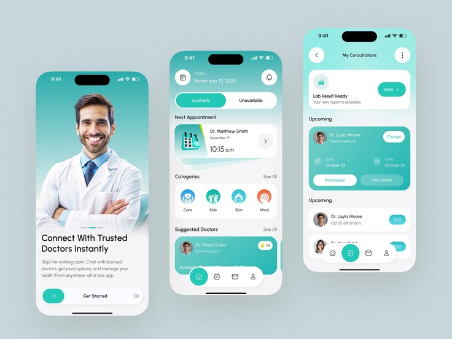

# MedPal — DESIGN.md

## Brand & Style

MedPal 是一位清醒、可靠、愿意陪患者把事情讲明白的就医伙伴。视觉不追求“高科技医疗”的冷硬感，也不使用过度促销的健康营销语言；它应当让用户在身体不舒服、时间紧或信息不确定时，快速看懂下一步。

整体方向改为 **浅雾青绿医疗（Soft Aqua Care）**：大面积近白浅青建立明亮、低压力的阅读环境，明亮青绿色只负责引导行动，白色圆角卡片承载信息，灰青色文字提供稳定阅读。上传的参考图作为主要视觉锚点：浅灰蓝背景、白色圆角设备、轻盈青绿色卡片、圆角悬浮 Tab、医生头像和预约信息都应在成品中一眼可见。

Spines win on conflict：后续 mockup、外部设计稿或图片与本规范冲突时，以本 `DESIGN.md` 和配套 `EXPERIENCE.md` 为准。

## Colors

- **浅雾青底（`{colors.surface-base}`）**是主要画布，接近参考图的浅灰蓝，但更亮、更适合中老年用户长期阅读。它不承担状态含义。
- **白色卡片（`{colors.surface-raised}`）**承载医生、号源、预约和消息等可操作内容；卡片之间通过留白和轻阴影区分，不堆叠粗边框。
- **明亮青绿（`{colors.primary}`）**代表“可以现在做”的动作：预约、确认、查看、当前导航。优先使用深青绿文字叠在明亮浅色按钮上，不用深色大面积压住屏幕。
- **中浅青绿（`{colors.primary-deep}`）**仅用于选中态、关键图标和少量强调，不再作为整张预约卡的深色底。
- **青绿浅底（`{colors.primary-soft}`）**用于选中时间、轻量提示和状态背景；不在一个组件里同时叠加多种青绿色。
- **灰青墨（`{colors.ink-primary}`）**是正文和关键数字，避免纯黑造成刺眼；**灰青字（`{colors.ink-secondary}`）**用于辅助说明；**雾灰字（`{colors.ink-muted}`）**只用于不可用或次要元信息。
- **语义色**：`{colors.success}` 只用于预约成功/已完成，`{colors.warning}` 用于待确认/临近提醒，`{colors.danger}` 用于取消、不可逆操作和错误说明。语义色不作为装饰渐变。
- 不使用彩虹渐变、荧光绿、大面积纯黑或红色满屏错误；医疗风险不能只靠颜色传达。

## Typography

使用微信小程序可稳定获取的系统无衬线字体，中文优先 PingFang SC / 系统默认。主要使用人群为20-40岁，排版目标是“快速看懂、快速行动”，在保证可读性的前提下减少首屏文字占用。

- `display`：首页问候或预约成功的单一主标题，28px/700；同一屏最多出现一次。
- `title`：区块标题、医生姓名、预约项目标题，20px/700。
- `body`：说明、按钮文字和主要信息，16px/400；关键操作可用 600。
- `label`：科室、日期、时间、状态等短标签，14px/600。
- `caption`：来源、更新时间、辅助说明，12px/400；不能承载关键条件。
- 行高优先于压缩：正文至少 1.5 倍行高，按钮文字至少 14px；核心主按钮仍建议不低于16px。动态字号或系统字体放大后，按钮和卡片允许增高，不截断关键内容。

## Layout & Spacing

以 8px 为基础单位，核心节奏为 12 / 16 / 20 / 24 / 32 / 40px。移动端页面左右安全边距使用 `{spacing.page-gutter}`；卡片内边距默认 `{spacing.5}`，大区块之间使用 `{spacing.7}`。

首页采用单列纵向流：问候与定位 → 主行动 → 当前预约 → 服务入口 → 推荐医生。首屏不同时放置三个以上主按钮；推荐信息可以继续滚动，但不能挤压当前预约。

微信小程序页面需要兼容顶部状态栏和底部安全区。底部 Tab 采用参考图式的白色悬浮圆角胶囊，固定在安全区上方，内容滚动区域额外预留 `{spacing.bottom-safe}`；弹层最多一层，不在弹层上再叠弹层。

## Elevation & Depth

层级优先通过色调和间距建立。卡片使用柔和环境阴影：`0 10px 28px rgba(65, 139, 137, 0.10)`；悬浮 Tab 使用 `0 8px 24px rgba(65, 139, 137, 0.16)`。不使用锐利黑色阴影，不让阴影成为医疗状态提示。

边框只用于输入框、分组边界和不可用状态，使用 `{colors.border-subtle}` 的 1px 线。卡片在浅色底上不再叠加双重边框。

## Shapes

形状语言是“柔软、宽松、易点按”。`{rounded.sm}` 用于输入与小标签，`{rounded.md}` 用于列表项，`{rounded.lg}` 用于医生卡片和核心模块，`{rounded.xl}` 用于底部悬浮 Tab、底部抽屉与大面积状态容器。胶囊形 `{rounded.full}` 用于主按钮和状态 Chip；Tab 的选中项使用独立圆形按钮，形成参考图的中心视觉锚点。

头像使用圆形，图片和卡片的裁切跟随容器圆角。参考图中的大圆角设备感转化为页面卡片圆角，不引入手机样机边框。

## Components

- **顶部问候栏**：左侧显示“早上好，林女士”，下方为当前位置或就诊人切换；右侧为通知入口。问候不是营销标题，必须让出空间给当前任务。
- **主行动区**：使用一张浅色或白色大卡片，最多两个行动：“找医生”“查看预约”。主按钮采用 `{components.button-primary}`，高度不低于 52px，次行动为同样可读的描边按钮。
- **当前预约卡**：采用 `{components.appointment-card}`，使用浅青绿底 + 灰青墨文字，显示日期、时间、科室、医生与下一步动作。避免深色整卡造成阅读压力。
- **服务入口**：默认使用 2×2 模块而不是四列小图标；每项拥有清晰的线性图标、20px 左右标题和一行说明。默认入口建议为“找医生、预约、就医陪伴、健康记录”，真实业务需确认后替换。
- **医生卡片**：头像、姓名、科室/职称、评分或擅长标签、最近可预约时间。卡片整体可点击，右侧只保留一个主动作；未认证信息不显示为“可信”徽章。
- **时间选择器**：日期使用横向日期带，时间使用 2 列网格。选中使用 `{colors.primary-soft}` + `{colors.primary-deep}` 文字 + 形状/勾选辅助，禁用时间降低对比度并注明“已约满”。
- **底部 Tab**：使用 `{components.bottom-nav-floating}`，五项固定为首页、找医生、预约、消息、我的；整体为白色悬浮圆角胶囊，中心“预约”使用 `{colors.primary}` 圆形按钮，其他项为图标 + 13px 文字。Tab 高度不低于 64px，触控区域不低于 48px。
- **反馈与状态**：成功使用浅青绿色块和清晰文字；错误使用文字说明 + 可执行按钮；Toast 只反馈短暂结果，不能承载预约条款或医疗建议。
- **图片使用**：参考图仅作为视觉方向输入；真实头像、医生照片与健康记录图片必须来自授权素材或业务数据，并提供加载、失败与隐私占位状态。

## Do's and Don'ts

| Do | Don't |
|---|---|
| 用青绿强调“现在可以做的下一步” | 用青绿给所有卡片、标签和装饰上色 |
| 用白卡 + 留白组织就医信息 | 用密集表格或连续渐变堆叠信息 |
| 让当前预约在首页首屏可见 | 把预约藏在多级菜单或抽屉里 |
| 使用真实、明确、可执行的中文微文案 | 复制参考图中的英文营销句式 |
| 对加载、无号源、失败、隐私状态给出恢复路径 | 只显示“系统错误”或只用颜色表示状态 |
| 让头像、照片与隐私占位有明确来源 | 把上传参考图整张当作真实医生头像素材 |
